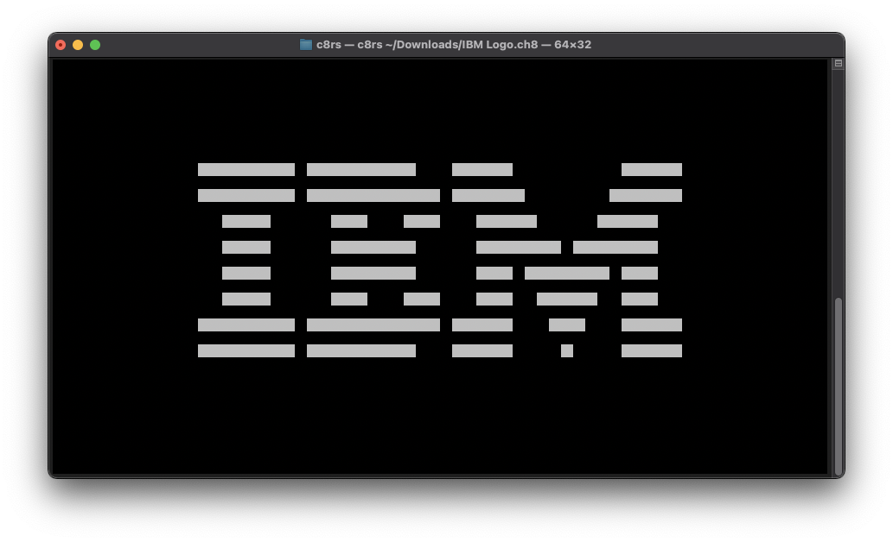

# c8rs: Rusty chip8 emulator for your terminal.
because i like doing fancy stuff in languages i haven't yet mastered just when exam season is rearing its ugly head. 😀

---
### This project depends on
  * [termion](https://docs.rs/termion/latest/termion/)
  * [clap](https://docs.rs/clap/latest/clap/)

---
#### IBM test [rom](https://github.com/loktar00/chip8/blob/master/roms/IBM%20Logo.ch8):

[^1]

[^1]: *NOTE: My example images use a square font in order to make the terminal output look as close as the real deal as possible.* 

